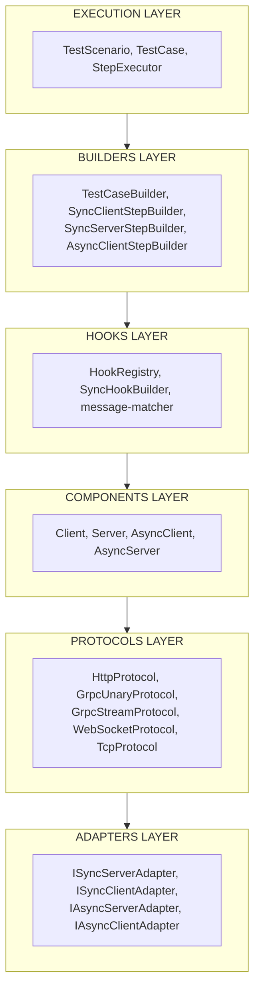

# Testurio

A declarative E2E/integration testing framework for distributed systems with multi-protocol support.

[](https://www.npmjs.com/package/testurio)
[](https://opensource.org/licenses/MIT)

## Features

- **Multi-Protocol Support** - HTTP, gRPC (Unary & Streaming), WebSocket, TCP
- **Declarative API** - Write tests in execution order with clear, readable syntax
- **Component-Based** - Define clients, mocks, and proxies as reusable components
- **Type-Safe** - Full TypeScript support with automatic type inference via `test.use(component)`
- **Flow Testing** - Test complete request flows through your distributed system
- **Flexible Mocking** - Mock responses, add delays, drop messages, or proxy through

## Installation

```bash
npm install testurio --save-dev
```

## Quick Start

1. Register components of test scenario
2. Write test-case steps
3. Run test scenario, generate report

```typescript
import { TestScenario, testCase, Client, Server, HttpProtocol } from 'testurio';

// Define components with protocol - types are automatically inferred
const httpClient = new Client('client', {
  protocol: new HttpProtocol(),
  targetAddress: { host: 'localhost', port: 3000 },
});

const httpServer = new Server('mock', {
  protocol: new HttpProtocol(),
  listenAddress: { host: 'localhost', port: 3000 },
});

// Create scenario
const scenario = new TestScenario({ name: 'User API Test' });

// Write test cases
const tc = testCase('Get user by ID', (test) => {
  const client = test.use(httpClient);      // use "httpClient" in test case
  const mock = test.use(httpServer);  // use "httpServer" in test case

  // Step 1: Client sends request
  client.request('getUsers', { method: 'GET', path: '/users' });

  // Step 2: Mock handles request
  mock
    .onRequest('getUsers', { method: 'GET', path: '/users' })
    .mockResponse(() => ({
      code: 200,
      body: [{ id: 1, name: 'Alice', email: 'alice@example.com' }],
    }));

  // Step 3: Client receives and validates response
  client
    .onResponse('getUsers')
    .assert((res) => res.body[0].id === 1);
});

// Run the test
const result = await scenario.run(tc);
console.log(result.passed); // true
```

## Roadmap

- [ ] **testurio-cli** - Type definition generation from API specifications
  - [ ] OpenAPI/Swagger → HTTP service definitions
  - [ ] AsyncAPI → WebSocket/async service definitions
  - [ ] Protobuf → gRPC service definitions
- [ ] **Message Queue Support** - Integration with message brokers
  - [ ] RabbitMQ (AMQP protocol)
  - [ ] Kafka (producer/consumer testing)
  - [ ] Redis (pub/sub)
- [ ] **Datasource Support** - Database integrations
  - [ ] SQL (PostgreSQL, MySQL, SQLite)
  - [ ] Redis (key-value)

## Examples

### gRPC Example

```typescript
import { TestScenario, testCase, Server, Client } from 'testurio';
import { GrpcUnaryProtocol } from '@testurio/protocol-grpc';

// Define gRPC components with proto schema
const grpcClient = new Client('api', {
  protocol: new GrpcUnaryProtocol({ schema: 'user.proto', serviceName: 'UserService' }),
  targetAddress: { host: 'localhost', port: 5000 },
});

const grpcServer = new Server('backend', {
  protocol: new GrpcUnaryProtocol({ schema: 'user.proto' }),
  listenAddress: { host: 'localhost', port: 5000 },
});

const scenario = new TestScenario({
  name: 'gRPC User Service Test',
  components: [grpcServer, grpcClient],
});

const tc = testCase('GetUser RPC', (test) => {
  const api = test.use(grpcClient);
  const backend = test.use(grpcServer);

  // Step 1: Send gRPC request
  api.request('GetUser', { user_id: 42 });

  // Step 2: Mock handles request
  backend.onRequest('GetUser').mockResponse((req) => ({
    code: 200,
    body: { user_id: req.user_id, name: 'John Doe' },
  }));

  // Step 3: Handle response
  api.onResponse('GetUser').assert((res) => res.body.name === 'John Doe');
});
```

### WebSocket/Async Example

```typescript
import { TestScenario, testCase, AsyncClient, AsyncServer } from 'testurio';
import { WebSocketProtocol } from '@testurio/protocol-ws';

// Define WebSocket service types
interface WsMessages {
  clientMessages: {
    ping: { seq: number };
  };
  serverMessages: {
    pong: { seq: number; timestamp: number };
  };
}

// Define WebSocket components with typed protocol
const wsClient = new AsyncClient('client', {
  protocol: new WebSocketProtocol<WsMessages>(),
  targetAddress: { host: 'localhost', port: 4000 },
});

const wsServer = new AsyncServer('server', {
  protocol: new WebSocketProtocol<WsMessages>(),
  listenAddress: { host: 'localhost', port: 4000 },
});

const scenario = new TestScenario({
  name: 'WebSocket Echo Test',
  components: [wsServer, wsClient],
});

const tc = testCase('Ping-Pong', (test) => {
  const client = test.use(wsClient);
  const server = test.use(wsServer);

  // Step 1: Client sends ping
  client.sendMessage('ping', { seq: 1 });

  // Step 2: Server responds with pong
  server.onMessage('ping').mockEvent('pong', (payload) => ({
    seq: payload.seq,
    timestamp: Date.now(),
  }));

  // Step 3: Client receives pong
  client.onEvent('pong').assert((payload) => payload.seq === 1);
});
```

### Type-Safe HTTP Example

Define service types to get full type safety across your tests:

```typescript
import { TestScenario, testCase, Client, Server, HttpProtocol } from 'testurio';

// HTTP Service Definition
interface HttpServiceDef {
  getUsers: {
    request: { method: 'GET'; path: '/users'; body?: never };
    response: { code: 200; body: User[] };
  };
  createUser: {
    request: { method: 'POST'; path: '/users'; body: CreateUserPayload };
    response: { code: 201; body: User };
  };
}

// WebSocket/Async Service Definition
interface WsServiceDef {
  clientMessages: {
    getUser: { userId: number };
    subscribe: { channel: string };
  };
  serverMessages: {
    user: { userId: number; name: string; email: string };
    subscribed: { subscriptionId: string; status: string };
  };
}

// Define components with protocol - types are automatically inferred
const httpClient = new Client('api', {
  protocol: new HttpProtocol<HttpServiceDef>(),
  targetAddress: { host: 'localhost', port: 3000 },
});

const httpServer = new Server('backend', {
  protocol: new HttpProtocol<HttpServiceDef>(),
  listenAddress: { host: 'localhost', port: 3000 },
});

// Create scenario with components
const scenario = new TestScenario({
  name: 'User API Test',
  components: [httpServer, httpClient],
});

// Write test cases with full type safety via test.use()
const tc = testCase('Get user by ID', (test) => {
  const api = test.use(httpClient);      // Fully typed step builder!
  const backend = test.use(httpServer);  // Fully typed step builder!

  // Step 1: Client sends request
  api.request('getUsers', { method: 'GET', path: '/users' });

  // Step 2: Mock handles request
  backend.onRequest('getUsers', { method: 'GET', path: '/users' })
    .mockResponse(() => ({
      code: 200,
      body: [{ id: 1, name: 'Alice', email: 'alice@example.com' }],
    }));

  // Step 3: Client receives and validates response
  api.onResponse('getUsers').assert((res) => res.body[0].id === 1);
});

// Run the test
const result = await scenario.run(tc);
console.log(result.passed); // true
```

## Core Concepts

### Components

Components are high-level abstractions that own protocol adapters and manage their lifecycle.

| Component       | Protocol Type | Role   | Description                                                    |
| --------------- | ------------- | ------ | -------------------------------------------------------------- |
| `Client`        | Sync          | Client | Sends HTTP/gRPC unary requests to a target server              |
| `Server`        | Sync          | Mock   | Listens for requests and returns configured responses          |
| `Server`        | Sync          | Proxy  | Intercepts requests, can transform, mock, or forward to target |
| `AsyncClient`   | Async         | Client | Sends messages over WebSocket/TCP/gRPC streaming connections   |
| `AsyncServer`   | Async         | Mock   | Listens for messages and sends response events                 |
| `AsyncServer`   | Async         | Proxy  | Intercepts messages, can transform or forward to target        |

**Server as Proxy**: When a `Server` or `AsyncServer` has both `listenAddress` and `targetAddress`, it acts as a proxy:

```typescript
// Server acting as mock (no targetAddress)
const mock = new Server('backend', {
  protocol: new HttpProtocol<ServiceDef>(),
  listenAddress: { host: 'localhost', port: 3000 },
});

// Server acting as proxy (has targetAddress)
const proxy = new Server('gateway', {
  protocol: new HttpProtocol<ServiceDef>(),
  listenAddress: { host: 'localhost', port: 3001 },
  targetAddress: { host: 'localhost', port: 3000 },  // forwards to backend
});
```

### Protocols

Protocols are stateless adapter factories. Components own the adapters and manage their lifecycle.

| Protocol             | Type  | Package                   | Use Case                     |
| -------------------- | ----- | ------------------------- | ---------------------------- |
| `HttpProtocol`       | Sync  | `testurio`                | REST APIs                    |
| `GrpcUnaryProtocol`  | Sync  | `@testurio/protocol-grpc` | gRPC unary calls             |
| `GrpcStreamProtocol` | Async | `@testurio/protocol-grpc` | gRPC bidirectional streaming |
| `WebSocketProtocol`  | Async | `@testurio/protocol-ws`   | WebSocket connections        |
| `TcpProtocol`        | Async | `@testurio/protocol-tcp`  | Custom TCP protocols         |

```typescript
// Sync protocols: createServer() / createClient() return adapters
const httpProtocol = new HttpProtocol<ServiceDef>();
const serverAdapter = await httpProtocol.createServer({ listenAddress });
const clientAdapter = await httpProtocol.createClient({ targetAddress });

// Async protocols: same pattern
const wsProtocol = new WebSocketProtocol<WsMessages>();
const serverAdapter = await wsProtocol.createServer({ listenAddress });
const clientAdapter = await wsProtocol.createClient({ targetAddress });
```

### Hook Methods

#### Sync Protocols (HTTP, gRPC Unary)

```typescript
backend.onRequest('messageType', options?)
  .mockResponse((req) => ({ status, headers, body }))  // Return response
  .delay(ms)                                           // Add latency
  .drop();                                             // Drop request
```

#### Async Protocols (WebSocket, TCP, gRPC Stream)

```typescript
backend.onMessage('MessageType')
  .mockEvent('ResponseType', (payload) => response)   // Send response event
  .proxy((payload) => transformedPayload)             // Forward/transform
  .delay(ms)                                          // Add latency
  .drop();                                            // Drop message
```

## API Reference

### TestScenario

```typescript
const scenario = new TestScenario({
  name: string,
  components: ComponentConfig[],
});

// Lifecycle hooks
scenario.init((test) => { /* setup */ });
scenario.stop((test) => { /* teardown */ });

// Run tests
const result = await scenario.run(testCase);
const results = await scenario.runAll([testCase1, testCase2]);
```

### testCase

```typescript
const tc = testCase('Test name', (test) => {
  // Type-safe component access via test.use()
  const api = test.use(httpClient);       // Returns typed SyncClientStepBuilder
  const backend = test.use(httpServer);   // Returns typed SyncServerStepBuilder
  const wsClient = test.use(asyncClient); // Returns typed AsyncClientStepBuilder
  const wsServer = test.use(asyncServer); // Returns typed AsyncServerStepBuilder

  // Utilities
  test.wait(ms);
  test.waitUntil(() => condition, { timeout });
});
```

### Client API

```typescript
// Sync (HTTP, gRPC Unary)
client.request('messageType', options, traceId?);
client.onResponse('messageType', traceId?).assert((res) => boolean);

// Async (WebSocket, TCP)
asyncClient.sendMessage('MessageType', payload, traceId?);
asyncClient.onEvent('ResponseType', matcher?).assert((payload) => boolean);
asyncClient.waitMessage('ResponseType', { timeout?, matcher? });
```

### Mock API

```typescript
// Sync
mock.onRequest('messageType', options?)
  .mockResponse((req) => response)
  .delay(ms)
  .drop();

// Async
asyncMock.onMessage('MessageType', matcher?)
  .mockEvent('ResponseType', (payload) => response)
  .delay(ms)
  .drop();
```

## Best Practices

1. **Declare components first** - Get component references at the start of each test
2. **Write steps in execution order** - Request → Mock handles → Response
3. **Use traceId for multiple requests** - Correlate requests with responses explicitly
4. **Keep mock handlers simple** - Avoid complex logic in response handlers

## Architecture



| Layer          | Responsibility                                               |
| -------------- | ------------------------------------------------------------ |
| **Execution**  | Orchestrate test execution                                   |
| **Builders**   | Fluent API for building test steps                           |
| **Hooks**      | Message interception for test steps                          |
| **Components** | High-level abstractions that own adapters and manage state   |
| **Protocols**  | Stateless adapter factories (`createServer`, `createClient`) |
| **Adapters**   | Protocol-specific I/O operations (owned by components)       |

## License

MIT 
