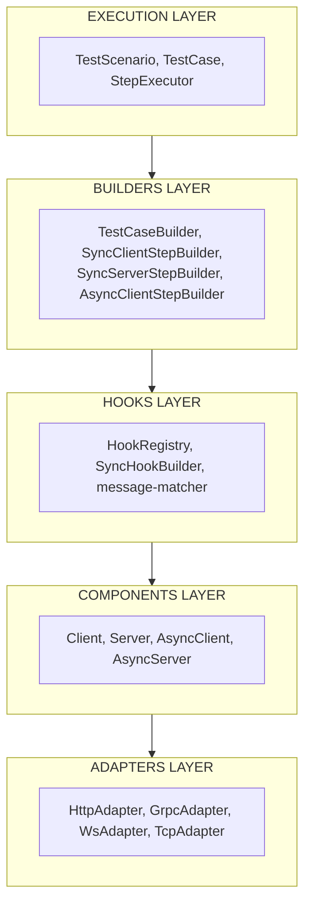

# Testurio

A declarative E2E/integration testing framework for distributed systems with multi-protocol support.

[](https://www.npmjs.com/package/testurio)
[](https://opensource.org/licenses/MIT)

## Features

- **Multi-Protocol Support** - HTTP, gRPC (Unary & Streaming), WebSocket, TCP
- **Declarative API** - Write tests in execution order with clear, readable syntax
- **Component-Based** - Define clients, mocks, and proxies as reusable components
- **Type-Safe** - Full TypeScript support with protocol-specific generics
- **Flow Testing** - Test complete request flows through your distributed system
- **Flexible Mocking** - Mock responses, add delays, drop messages, or proxy through

## Installation

```bash
npm install testurio --save-dev
```

## Quick Start

### HTTP Example

```typescript
import { TestScenario, testCase, MockConfig, ClientConfig, Http } from 'testurio';

// Define your test scenario with components
const scenario = new TestScenario({
  name: 'User API Test',
  components: [
    new MockConfig({
      name: 'backend',
      listenAddress: { host: 'localhost', port: 3000 },
      protocol: new Http(),
    }),
    new ClientConfig({
      name: 'api',
      targetAddress: { host: 'localhost', port: 3000 },
      protocol: new Http(),
    }),
  ],
});

// Write test cases in declarative, sequential order
const tc = testCase('Get user by ID', (test) => {
  const api = test.client('api');
  const backend = test.mock('backend');

  // Step 1: Client sends request
  api.request('getUser', { method: 'GET', path: '/users/1' });

  // Step 2: Mock handles request and returns response
  backend.onRequest('getUser', { method: 'GET', path: '/users/1' })
    .mockResponse(() => ({
      status: 200,
      headers: {},
      body: { id: 1, name: 'Alice', email: 'alice@example.com' },
    }));

  // Step 3: Client receives and validates response
  api.onResponse('getUser').assert((res) => res.id === 1);
});

// Run the test
const result = await scenario.run(tc);
console.log(result.passed); // true
```

### gRPC Example

```typescript
import { TestScenario, testCase, MockConfig, ClientConfig, GrpcUnary } from 'testurio';

const scenario = new TestScenario({
  name: 'gRPC User Service Test',
  components: [
    new MockConfig({
      name: 'backend',
      listenAddress: { host: 'localhost', port: 5000 },
      protocol: new GrpcUnary({ schema: 'user.proto' }),
    }),
    new ClientConfig({
      name: 'api',
      targetAddress: { host: 'localhost', port: 5000 },
      protocol: new GrpcUnary({ schema: 'user.proto', serviceName: 'UserService' }),
    }),
  ],
});

const tc = testCase('GetUser RPC', (test) => {
  const api = test.client('api');
  const backend = test.mock('backend');

  // Step 1: Send gRPC request
  api.request('GetUser', { payload: { user_id: 42 } });

  // Step 2: Mock handles
  backend.onRequest('GetUser').mockResponse((req) => ({
    status: 200,
    headers: {},
    body: { user_id: req.payload.user_id, name: 'John Doe' },
  }));

  // Step 3: Handle response
  api.onResponse('GetUser').assert((res) => res.name === 'John Doe');
});
```

### WebSocket/Async Example

```typescript
import { TestScenario, testCase, MockConfig, ClientConfig, TcpProto } from 'testurio';

interface Messages {
  Ping: { seq: number };
  Pong: { seq: number; timestamp: number };
}

const scenario = new TestScenario({
  name: 'WebSocket Echo Test',
  components: [
    new MockConfig({
      name: 'server',
      listenAddress: { host: 'localhost', port: 4000 },
      protocol: new TcpProto({ schema: '' }),
    }),
    new ClientConfig({
      name: 'client',
      targetAddress: { host: 'localhost', port: 4000 },
      protocol: new TcpProto({ schema: '' }),
    }),
  ],
});

const tc = testCase('Ping-Pong', (test) => {
  const client = test.asyncClient<Messages>('client');
  const server = test.asyncMock<Messages>('server');

  // Step 1: Client sends ping
  client.sendMessage('Ping', { seq: 1 });

  // Step 2: Server responds with pong
  server.onMessage('Ping').mockEvent('Pong', (payload) => ({
    seq: payload.seq,
    timestamp: Date.now(),
  }));

  // Step 3: Client receives pong
  client.onEvent('Pong').assert((payload) => payload.seq === 1);
});
```

## Core Concepts

### Components

- **Client** - Sends requests to a target address
- **Mock** - Listens for requests and returns configured responses
- **Proxy** - Intercepts requests, can transform or forward them

### Protocols

| Protocol | Type | Use Case |
|----------|------|----------|
| `Http()` | Sync | REST APIs |
| `GrpcUnary()` | Sync | gRPC unary calls |
| `GrpcStream()` | Async | gRPC bidirectional streaming |
| `WebSocket()` | Async | WebSocket connections |
| `TcpProto()` | Async | Custom TCP protocols |

### Hook Methods

#### Sync Protocols (HTTP, gRPC Unary)

```typescript
backend.onRequest('messageType', options?)
  .mockResponse((req) => ({ status, headers, body }))  // Return response
  .delay(ms)                                           // Add latency
  .drop();                                             // Drop request
```

#### Async Protocols (WebSocket, TCP, gRPC Stream)

```typescript
backend.onMessage('MessageType')
  .mockEvent('ResponseType', (payload) => response)   // Send response event
  .proxy((payload) => transformedPayload)             // Forward/transform
  .delay(ms)                                          // Add latency
  .drop();                                            // Drop message
```

## API Reference

### TestScenario

```typescript
const scenario = new TestScenario({
  name: string,
  components: ComponentConfig[],
});

// Lifecycle hooks
scenario.init((test) => { /* setup */ });
scenario.stop((test) => { /* teardown */ });

// Run tests
const result = await scenario.run(testCase);
const results = await scenario.runAll([testCase1, testCase2]);
```

### testCase

```typescript
const tc = testCase('Test name', (test) => {
  // Sync components
  const client = test.client('name');
  const mock = test.mock('name');
  const proxy = test.proxy('name');

  // Async components
  const asyncClient = test.asyncClient<Messages>('name');
  const asyncMock = test.asyncMock<Messages>('name');
  const asyncProxy = test.asyncProxy<Messages>('name');

  // Utilities
  test.wait(ms);
  test.waitUntil(() => condition, { timeout });
});
```

### Client API

```typescript
// Sync (HTTP, gRPC Unary)
client.request('messageType', options, traceId?);
client.onResponse('messageType', traceId?).assert((res) => boolean);

// Async (WebSocket, TCP)
asyncClient.sendMessage('MessageType', payload, traceId?);
asyncClient.onEvent('ResponseType', matcher?).assert((payload) => boolean);
asyncClient.waitMessage('ResponseType', { timeout?, matcher? });
```

### Mock API

```typescript
// Sync
mock.onRequest('messageType', options?)
  .mockResponse((req) => response)
  .delay(ms)
  .drop();

// Async
asyncMock.onMessage('MessageType', matcher?)
  .mockEvent('ResponseType', (payload) => response)
  .delay(ms)
  .drop();
```

## Best Practices

1. **Declare components first** - Get component references at the start of each test
2. **Write steps in execution order** - Request → Mock handles → Response
3. **Use traceId for multiple requests** - Correlate requests with responses explicitly
4. **Keep mock handlers simple** - Avoid complex logic in response handlers

## Architecture



| Layer | Responsibility |
|-------|----------------|
| **Execution** | Orchestrate test execution |
| **Builders** | Fluent API for building test steps |
| **Hooks** | Message interception for test steps |
| **Components** | High-level protocol abstractions |
| **Adapters** | Protocol-specific I/O operations |


## License

MIT 
